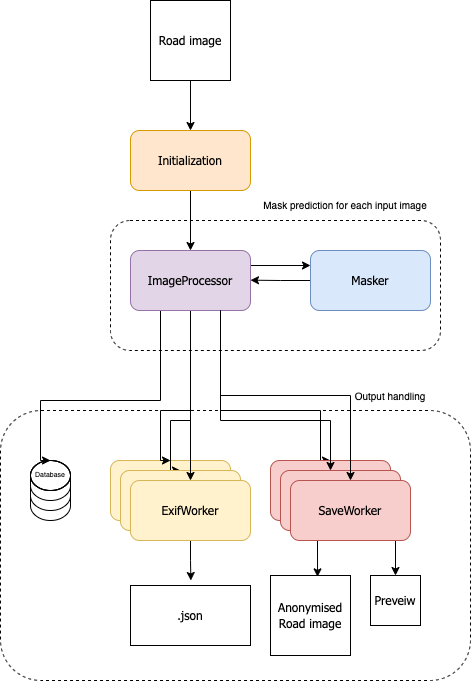
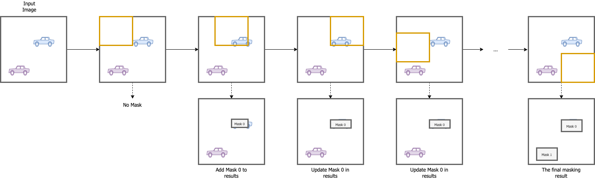

# Image Anonymisation
The Image Anonymisation for the Norwegian Public Road Administration(NPRA) is
an end-to-end solution for anonymisation of people and vehicles in images.
It supports the anonymisation of planar/field-of-view-images and 360°-images.
The project's main purpose is to provide anonymised road images to the NPRA’s public open source web application,
[Vegbilder](https://vegbilder.atlas.vegvesen.no/).
Vegbilder's source code can be found at [NPRA/Vegbilder](https://github.com/NPRA/VegBilder).

This Wiki-page is meant to be complimentary documentation of the development,
structure and implementation of this project, which does not fit in the repo's `README.md`-file


# Development Cycles
The first version of the image anonymisation was developed in 2019/2020.
It supported end-to-end image anonymisation "planar", also called "field-of-view", images.

The second version of the image anonymisation was developed in 2021/2022.
There were four main updates and differences to this version:
1. The anonymisation should support 360°-images in a satisfactory manner
2. The anonymisation should *not* output the `.wepb`-files
3. The anonymisation should be able to produce "previews" of the image of a desired dimension and position.
4. The output `.json`-file should have updated fields and values to comply with new standards.


#### Planar vs. 360°-images
There were notable differences that had an impact on
the choices that were made during the continuation of this project to support 360°-images.

1. The "flat" 360°-images were curved, consequently, making the objects to be detected curved and 
less likely to be detected fully.
2. The images were significantly larger in size
3. The exif-data is different in 360°-images.

#### Changes from V.1 to V.2

The following changes to V.1 was implemented to support the new features of V.2
and to tackle the issues raised in the section above:

* The user can enable the `use_cutouts`-configuration.
This will create a cutout and do a "sliding window" technique over the image
and predict anonymisation masks for each position of the cutout.
The dimension and how many steps the window should slide at a time (height-wise and length wise)
is also defined by the user in the `config`-file.

* The generated `.json`-file has new and updated fields

* The exif-data is read from the `RefLinkInfo`-exif tag for 360°-images.

* If the image does not contain either the `ImageProperties` or `RefLinkInfo`,
it will derive GPS-data from the `GPSInfo`-exif tag.

*  All output of `.wepb`-files are commented out.

* The user can enable preview-generation in the configuration.
This will produce a `.jpg`-image in the desired location

* A `create_json.py` script is added. This enables the user to *only* produce previews.

* [bugfix] `exif_feltkode` also parses lane codes for lanes such as public transport lanes, bike lanes, etc.
 They are denoted as "F\*number\*\*word character\*". E.g F5K


###### New/Changed JSON-fields
* `exif_dataeier`: Set in the config file by the user.
* `exif_camera`: Read from the exif data of the input image
* `exif_imagetype`: Set in the config file by the user.
* `exif_imageheight`: Read from image data
* `exif_imagewidth`: Read from image data
* `exif_speed_ms`: [changed name] from `exif_speed`
* `exif_moh`: Calculated by: `Altitude - geoidalseparation`. 
* `exif_strekningsnavn`: Read from the exif data of the input image.
* `exif_roadtype`: Read from the exif data of the input image.
* `exif_filnavn_preview`: Generated based on file name of the input image.


# Architecture


| The simplified architecture of the Image Anonymisation |
|    :----:   |
|     |

The image anonymisation consists of mainly six components
as well as multiple helper-scripts and classes.

#### Main components
* [`ImageProcessor`](#imageprocessor)
* [`Masker`](#masker)
* `ExifWorker`
* `SaveWorker`

#### Helper Classes
* `TreeWalker`
* `Path`
* `DatabaseClient.py`
* `Table.py`

##### ImageProcessor
The `ImageProcessor` will run the masker on either the image with or without the sliding window techinque.
If the sliding window is used, the masker is first used on the full image,
followed by the sliding windows.

| A visualisation of the cutout method |
|    :----:   |
|     |
|The **first row** shows the input image and how the orange sliding window moves over it. The **second row** shows the mask result-building process|

The window will first slide width-wise, then height-wise.
This is implemented by using a double for-loop.
Each masking result for each window will have to be combined
to make up one result for the image itself.
One issue is that distinct windows may predict masks for the same object.
These masks may also be different from each other.
To address this issue a comparison is made for each mask.
If there is a overlap in pixels of the newly predicted mask in the window
compared to any of the previously predicted masks for the image,
the the mask is assumed to already exist.
If the mak already exist, it's predicted data should be updated in the following manner:

1. The outer edges should be moved to be defined by the outermost pixels from either the existing mask or the new mask.
2. The bounding boxes should be updated to be the outermost value from either the existing or the new mask.
3. The prediction score should be added to a pool of all the other prediction scores that were made for one mask.
The average of all prediction for one masked object will determine the final score of this mask.
4. The prediction class should be added to a pool of all the other prediction classes that were made for one mask.
The majority vote of all the predictions for one masked object will determine the final prediction class for this mask.

After the results for the image is finished,
ExifWorkers and SaveWorkers are dispatched.

##### Masker

The `Masker` will run the model prediction on the image it gets as an input.
It will download the appropriate model if it does not exist in the `/models`-folder in the repo.
Additionally it will filter out some of the predictions which are not relevant for this anonymisation case.

##### ExifWorker
The `ExifWorker` generates and saves the `.json`-file.
It will read the exif data of the image.
The quality of the data of the input image is evaluated to one of three levels.

0. The lowest level of quality.
This level is given to an image where the exif-data cannot be derived.
 1. This level is given to an image with many of the values are missing.
 Oftentimes if this level is achieved, some of the values may be found in the path and the file name of the image.
 2. This is the highest quality level where all the exif data that is not optional exists.

NOTE: 
There also exists an `ExifWorkerOld` which will be used for older versions of how the Exif-data is formatted.
It will also look for the `ImageProperties` tag and read data from there.
 
#### SaveWorker
The `SaveWorker` is responsible to save the anonymised image and the potential preview image.
Additionally it will draw on the masks after the definitions in the configuration-file.

##### TreeWalker
The `TreeWalker` is a helper-class that finds all the relevant files.
The `walk()`-function will traverse the file tree and generate instances of `Path`-objects for each relevant file it finds.

#### Path
The `Path` is a class that contain all the path information relevant for a specified image.
It contains the filename, output file paths, archive file paths, input file paths and preview paths.

#### SDOGeometry
The SDOGeometry class is a helper class to represent a `SDO_GEOMETRY` object in Oracle Database.

## Scripts

#### Helper Scripts
* `email_sender.py`
* I/O
    * `exif_util.py`
    * `file_access_guard.py`
    * `file_checker.py`
    * `save.py`
    * `tf_dataset.py`
* Database
    * `formatters.py`
    * `geometry.py`
##### email_sender.py    
The `email_sender.py` is a helper script to send emails.
The sending of email is configured in the accompanying `config`-file when running. 
It supports three different types of email messages: 
1. `critical` for critical errors which cause the program to exit abnormally
2. `error` for processing errors which do not cause the program to exit.
3. `finished` for when the program exists normally.

##### exif_util.py
The `exif_util.py` is a helper script to parse the exif-data of an image and create metadata for the output `.json`-file.
It will create a `dict` from a template and parse the exif data to 
fill the `dict` with values. 

First it will try to get data from the `ImageProperties`-tag. 
The `ImageProperties` is an `XML` that contains road information such as 
Road name and number, Lane name and number, etc. 
It also contain important GPS-information of where the image was taken.

If the `ImageProperties`-tag does not exist in the image's exif,
it will try to get data from the `ReflinkInfo`-tag.
The `ReflinkInfoTag` is an `XML` that contains much the same road information
as in the `ImageProperties`-tag, but in a different format, thus, these tags need to be handled differently.

If the image exif data does not contain any of these aforementioned tags,
as much data as possible needs to be extracted from the `GPSInfo`-tag and the file path.
The filename of the road images are standardized on a specific format, 
making the information extraction somewhat predictable.

The script also contains functionality for writing a `.json`-file with the filled in `dict`.

##### file_access_guard.py
The `file_access_guard.py` is a script to help determine the existence and access of a path. 
It traverses a `Path`-object.

##### file_checker.py
The `file_checker.py` is a helper script that handles all the logic regarding what files to expect as outputs.
It reports what files are expected as outputs, what files are missing compared to the expected files
and clearing cached files.

##### save.py
The `save.py` is a helper script that handles the writing of the output anonymised image and the preview image.
It will draw the masks defined from the mask-prediction according to the settings in the `config`-file.
After the masks have been drawn on the image, the image is written to one or more of the following places:
* The input folder
* The output folder
* The archive folder

The script also handles the cropping and writing of the preview image according to the specifications in the `config`-file.
The preview is output to one or more of the following places:
* The input folder
* The output folder
* The archive folder
* A separate folder path specified in the `config`-file

##### tf_dataset.py
The `tf_dataset.py` is a helper script that can create a [TensorFlow Dataset](https://www.tensorflow.org/api_docs/python/tf/data/Dataset) 
from the image files in a path. 
It also has validation checks to ensure that an image is represtented as a valid 4D-tensor.

##### formatters.py
The `formatters.py` is a helper script that is used to get the correct information from the `.json`-file 
on a format that is accepted by the database.
There is one formatter function for every field in the `.json`-file

##### geometry.py
The `geometry.py` is a helper script to convert an instance of the `src.db.SDOGeometry` class 
to a `SDO_GEOMETRY` Oracle database object type.

#### Extra Scripts
There are several extra scripts that serve their own functionalities when invoked. 

* `anonymise_old.py` 
*`check_folders.py`
* `create_json.py`
* `create_preview.py`
* `evaluate.py`
* Database
    * `create_db_config.py`
    * `create_table.py`
    * `execute_sql.py`
    * `insert_geom_metadata.py`
    * `json_to_db.py`

##### anonymise_old.py
The `anonymise_old.py` script is a script to run anonymisation for images pre 2022. 
This will run an old version of the ExifWorker that is suited for the exif data format predating 2022.
The script will be deprecated once the older images are anonymised.

##### check_folders.py
The `check_folders.py` script is a script that will traverse a file tree with the `TreeWalker`
and check if the expected files are in the input, output or archive folders depending on the accompanying `config`-file.
It will create a cumulative status of how many files that are either of the following statuses:
* `OK`
* `Missing`
* `None`

This script is invoked by running the following command from root:
```
python -m script.check_folders <args>
```
##### create_json.py
The `create_json.py` script is a script that will create a `.json`-file for each of the valid image-files
found in the input folder path. 
It will traverse the input folder and use the `ExifWorker`-class to parse the exif-data in the input images
as well as write the output files to the desired locations.

This script is invoked by running the following command from root:
```
python -m script.create_json.py <args>
```
##### create_preview.py
The `create_preview.py` script is a script that will traverse the file tree with the `TreeWalker` 
and for each image found, create a cropped preview of it. 
The preview's dimension and position is defined in the accompanying `config`-file.
The preview is written to the output locations also defined in the accompanying `config`-file.

This script is invoked by running the following command from root:
```
python -m script.check_preview <args>
```

##### evaluate.py
The `evaluate.py` script is a script to evaluate the mask prediciton model. 
It will evaluate the model on the COCO-data set and accumulate results over all the entries.
To run this script, pycocotools is required

This script is invoked by running the following command from root:
```
python -m script.evaluate <args>
```

##### create_db_config.py
The `create_db_config.py` script is a script that will create a configuration file based on the input arguments given.
It will also encrypt the password.

This script is invoked by running the following command from root:
```
python -m script.create_db_config <args>
```

##### create_table.py
The ``create_table.py`` script is a script that will create a table with the name specified as input argument.
The table that is created will have columns specified by the ``.yml``-file in the ``config/db_tables` that has a matching name.

This script is invoked by running the following command from root:
```
python -m script.create_table <args>
```

##### execute_sql.py
The ``create_table.py`` is a script that takes an sql statement as input either as a string or in a file.
It will create a ``DatabaseClient`` and execuite the sql statement through it

This script is invoked by running the following command from root:
```
python -m script.execute_sql <args>
```

##### insert_geom_metadata.py
The ``insert_geom_metadata.py`` is a script that inserts the meta data of the SDO Geometry into its own table.
It has helper functions that will extract and create the metadata in a compatible format.

This script is invoked by running the following command from root:
```
python -m script.insert_geom_metadata <args>
```
## Configuration

The main program and multiple other scripts require a **configuration-file**.
This repo comes with a default configuration file, which the programs and scripts will be using
if no other configuration file is defined and provided by the user.
The default configruation file can be found from root in `config/default_config.yml`.

If a user wishes to specify another configuration file to be used,
the option `-k` can be provided with the path to the configuration file to be used. 
Example:

```
python -i input/path -o output/path -k path/to/cutsom/config.yml
```

#### For 360°-images
There is a configuration file, `config/360_default_config.yml`, that can be used as a default configuration file for anonymising
360°-images.
This configuration file, however, will have to be provided by the user using the `-k` option.

### Fields
These are the fields in the configuration file.

#### Miscellaneous configuration parameters

| Field                         |           Default Value          | Data Type | Description                                                                                                                                                                                                                                                                                              |
|-------------------------------|:--------------------------------:|:---------:|----------------------------------------------------------------------------------------------------------------------------------------------------------------------------------------------------------------------------------------------------------------------------------------------------------|
| `data_eier`                   |              `null`              |   `str`   | Who owns the data. It is used as meta data in the `.json`-file                                                                                                                                                                                                                                           |
| `fylkesnummer`                |              `null`              |   `int`   | The "Fylkesnummer" ("county number")  or "kommunenummer" ("municipal number") that the image belongs to. If `force_fylke` is True, this value is inserted as `exif_fylke` in the `.json`-file. Otherwise it will be used as `exif_fylke´ if no other relevant value has been found in the image's exif data.                                                                                                                                                                                 |
| `force_fylke`                  |             `False`             |   `bool`  | If `True´the `exif_fylke`-field in the output `.json`-file will be forced to have the "fylkesnummer" value. This will overwrite potential other values that have been extracted from the exif data in the image.                                                                                                                                                                                      |
| `image_type`                  |             "Planar"             |   `str`   | What image type the input images are. Usually either "planar" or "360". It is used as meta data in the `.json`-file                                                                                                                                                                                      |
| `draw_mask`                   |              `True`              |   `bool`  | If `True` the mask is drawn on the output image. If `False`, it will not draw the mask on the ouput image.                                                                                                                                                                                               |
| `delete_input`                |              `False`             |   `bool`  | If `True` the input images are deleted from their folder.                                                                                                                                                                                                                                                |
| `force_remask` [Deprecated]   |              `False`             |   `bool`  | This feature is deprecated, as `.wepb`-files are no longer produced in version 2.0                                                                                                                                                                                                                       |
| `lazy_paths`                  |              `False`             |   `bool`  | If `True` the paths will be identified during the masking process, while `False` means that this happens before masking.                                                                                                                                                                                 |
| `file_access_retry_seconds`   |                10                |   `int`   | Number of seconds to wait before (re)trying to access a file/directory which cannot currently be reached. This  applies to both reading input files, and writing output files.                                                                                                                           |
| `file_access_timeout_seconds` |                60                |   `int`   | The number of seconds to wait before timeout to access a file/directory which cannot currently be reached. This  applies to both reading input files, and writing output files.                                                                                                                          |
| `datetime_format`             |        "%Y-%m-%d %H.%M.%S"       |    `str`  | The datetime format of the timestamp. See [datetime documentation for Python 3.7](https://docs.python.org/3.7/library/datetime.html#strftime-strptime-behavior) for more information.                                                                             |
| `log_file_name`               |    "{datetime}_{hostname}.log"   |   `str`   | A format string defining the log-file naming. Uses the format-string rules of Python 3 where variables can be inserted by {}.                                                                                                                                                                            |
| `log_level`                   |              "DEBUG"             |   `str`   | The level of logging that should be done during the running of the program or script. Some logging-outputs only occur on certain levels. The valid values are: {"DEBUG", "INFO", "WARNING", "ERROR"}                                                                                                     |
| `application_version`         |               "0.2"              |   `str`   | The version number of the application. It is used when producing the output `.json`-file on the format "P[application_version]K[date_of_last_edited_configfile]"                                                                                                                                                                                                                                                                    |
| `exif_mappenavn`              | "Vegbilder/{relative_input_dir}" |   `str`   | Formatter for `mappenavn` in the JSON-file. `relative_input_dir` is the path to the folder containing the image,  relative to `exif_top_dir` below. For instance, if the image is located at `C:\Foo\Bar\Baz\Hello\World.jpg`, and  `exif_top_dir = Bar`, then `relative_input_dir` will be `Baz\Hello`. |
| `exif_top_dir`                |           "tilSladding"          |   `str`   | Top directory for `relative_input_dir`. The `mappenavn` will not include this value, unless the direcotry is included in the `exif_mappenavn`-path.                                                                                                                                                      |
| `remove_imagetype_filepath`   |             `False`              |   `bool`  | If `True`, the image type will be removed from the file path in the `mappenavn`-field in the `.json`-file.                                                                                                                                                                                      |
| `flip_wkt`                    |             `False`              |   `bool`  | If `True`, the longitude and latitude values of the wkt gps string will flip their positions when reading the `.json`-file to the database. E.g: The wkt gps string a: `srid=4326;POINT Z( 1.0 2.0 66.08 )` becomes wkt gps string b: `srid=4326;POINT Z( 2.0 1.0 66.08 )`                                                                                                                                                                                       |

#### File I/O parameters

| Field                        | Default Value | Data Type | Description                                                                                                                                                                                                        |
|------------------------------|:-------------:|:---------:|--------------------------------------------------------------------------------------------------------------------------------------------------------------------------------------------------------------------|
| `remote_json`                |     `True`    |   `bool`  | If `True` an output `.json`-file, containing EXIF metadata of an image, will be written to the *output* directory. This does not exclude the option of writing to input folder or archive folder.                  |
| `local_json`                 |    `False`    |   `bool`  | If `True` an output `.json`-file, containing EXIF metadata of an image, will be written to the *input* directory. This does not exclude the option of writing to the output folder or the archive folder.          |
| `archive_json`               |    `False`    |   `bool`  | If `True` an output `.json`-file, containing EXIF metadata of an image, will be written to the *archive* directory. This does not exclude the option of writing to input folder or output folder.                  |
| `remote_preview`             |    `False`    |   `bool`  | If `True` a preview of dimensions defined by `preview_dim` and `preview_center` will be written to the *output* directory. This does not exclude the option of writing to the archive, input or a separate folder. |
| `local_preview`              |    `False`    |   `bool`  | If `True` a preview of dimensions defined by `preview_dim` and `preview_center` will be written to the *input* directory. This does not exclude the option of writing to the archive, output or a separate folder. |
| `archive_preview`            |    `False`    |   `bool`  | If `True` a preview of dimensions defined by `preview_dim` and `preview_center` will be written to the *archive* directory. This does not exclude the option of writing to the output, input or a separate folder. |
| `separate_preview_directory` |     `null`    |   `str`   | An absolute path string pointing to the location of where the preview images should be written to. Example: "C:\\Users\\username\\Documents\\preview_dir"                                                          |
| `preview_dim`                |  [2520, 1400] |   `list`  | The dimensions of the preview image. Format: [width, height]                                                                                                                                                       |
| `preview_center`             |  [0.45, 0.5]  |   `list`  | The center pixel of the preview in normalized format. Format: [height, width]                                                                                                                                      |                                                                                                                                                                                                                                                                                                                                                                                                                                                                                                             |

#### Parameters for asynchrounous execution

| Field                       | Default Value | Data Type | Description                                                                                                                     |
|-----------------------------|:-------------:|:---------:|---------------------------------------------------------------------------------------------------------------------------------|
| `enable_async`              |     `True`    |   `bool`  | If `True` the file exports will be executed asynchronously. This will increase the processing speed and reduce processing time. |
| `max_num_async_workers`     |       2       |   `int`   | The maximum number of asynchronous workers that are active at any given time. Should be `<= (CPU core count - 1)`               |                                                                                                                                                                                                                                                                                                     |

#### Parameters for the masking model

| Field                       | Default Value | Data Type | Description                                                                                                                                                                                                                                                                                                                                                                                                 |
|-----------------------------|:-------------:|:---------:|-------------------------------------------------------------------------------------------------------------------------------------------------------------------------------------------------------------------------------------------------------------------------------------------------------------------------------------------------------------------------------------------------------------|
| `model_type`                |    "Medium"   |   `str`   | The type of masking model to use. There are currently 3 available models with varying speed and accuracy. The slowest model produces the most accurate masks, while the masks from the medium model are slightly worse. The masks from the "Fast" model are currently not recommended due to poor quality. Must be either "Slow", "Medium" or "Fast". "Medium" is recommended.                              |
| `mask_dilation_pixels`      |       4       |   `int`   | Approximate number of pixels for mask dilation. This will help ensure that an identified object is completely covered by the corresponding mask. Set `mask_dilation_pixels: 0` to disable mask dilation.                                                                                                                                                                                                    |
| `max_num_pixels`            |   1000000000  |   `int`   | Maximum number of pixels in images to be processed by the masking model. If the number of pixels exceeds this value, it will be resized before the masker is applied. This will NOT change the resolution of the output image.                                                                                                                                                                              |
| `use_cutouts`               |    `False`    |   `bool`  | If `True`, the image processing will use a cutout method by using a "sliding window" making cutouts of the input image and masking each cutout.  This process is explained in detail [here](#imageprocessor). Using the cutout method is only recommended for larger images or curved images such as 360°-images. It makes the anonymisation more accurate, but it will slow the process down significantly. |
| `cutout_step_factor`        |   [800, 800]  |   `list`  | The number of steps the sliding window should move in directions [height, width]. The anonymisation will be more accurate for lower values, however, with the cost of speed.                                                                                                                                                                                                                                |
| `cutout_dim_downscale`      |     [4,4]     |   `list`  | The downscale of the sliding window compared to the input image dimensions. Format: [height, width].                                                                                                                                                                                                                                                                                                        |

#### Parameters controlling the appearance of the anonymised regions

| Field                       | Default Value | Data Type | Description                                                                                                                                                                                                                                                          |
|-----------------------------|:-------------:|:---------:|----------------------------------------------------------------------------------------------------------------------------------------------------------------------------------------------------------------------------------------------------------------------|
| `mask_color`                |     `null`    |   `list`  | RGB values of the color the mask should be drawn with. Setting this option will override the colors specified below. Example: Setting `mask_color: [50, 50, 50]` will make all masks dark gray.                                                                      |
| `blur`                      |       15      |   `int`   | Blurring coefficient (1-100) which specifies the degree of blurring to apply within the mask. When this parameter is specified, the image will be blurred, and not masked with a specific color. Set `blur: null` to disable blurring, and use colored masks instead |
| `gray_blur`                 |     `True`    |   `bool`  | Converts the image to grayscale before blurring. If blurring is disabled, this is ignored.                                                                                                                                                                           |
| `normalized_gray_blur`      |     `True`    |   `bool`  | If `True` it normalizes the gray level within each mask after blurring. NOTE: Requires `gray_blur: True`. With this, bright colors are indistinguishable from dark colors.                                                                                           |

#### E-mail configuration
Note: E-mail sending requires additional configuration. This is documented in the [README](../../README.md).

| Field                       | Default Value | Data Type | Description                                                                                      |
|-----------------------------|:-------------:|:---------:|--------------------------------------------------------------------------------------------------|
| `uncaught_exception_email`  |    `False`    |   `bool`  | If `True` end an email if the program exits abnormally due to an uncaught exception.             |
| `processing_error_email`    |    `False`    |   `bool`  | If `True` end an email if a processing error is encountered, but the program is able to continue |
| `finished_email`            |    `False`    |   `bool`  | If `True` end an email when the anonymisation finishes normally.                                 |
| `email_attach_log_file`     |    `False`    |   `bool`  | If `True` the log file will be attached to the emails sent.                                      |

#### Database configuration

Note: Database writing requires additional configuration. This is documented in the README.

When `write_exif_to_db: True`, the EXIF data will be written as a row to an Oracle database. The `src.db` module is
responsible for the database writing.


| Field                       | Default Value | Data Type | Description                                                                                   |
|-----------------------------|:-------------:|:---------:|-----------------------------------------------------------------------------------------------|
| `write_exif_to_db`          |    `False`    |   `bool`  | If `True` the Exif data will be written to the database                                       |
| `db_max_n_accumulated_rows` |      100      |   `int`   | The maximum number of rows to be accumulated locally before they are written to the database. |
| `db_max_n_errors`           |      1000     |   `int`   | The threshold number of failed updates/inserts before a ´RuntimeError´ is raised.             |
| `db_max_cache_size`         |      1000     |   `int`   | The maximum number of cached rows before a `RuntimeError is raised`                           |                                                                                                                                                                                                                                                                                                |                                                                                                           |


# The Next Steps


