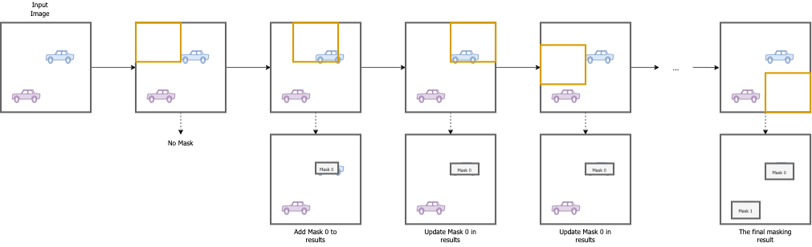

# Image Anonymisation
The Image Anonymisation for the Norwegian Public Road Administration(NPRA) is
an end-to-end solution for anonymisation of people and vehicles in images.
It supports the anonymisation of planar/field-of-view-images and 360°-images.
The project's main purpose is to provide anonymised road images to the NPRA’s public open source web application,
[Vegbilder](https://vegbilder.atlas.vegvesen.no/).
Vegbilder's source code can be found at [NPRA/Vegbilder](https://github.com/NPRA/VegBilder).

This Wiki-page is meant to be complimentary documentation of the development,
structure and implementation of this project, which does not fit in the repo's `README.md`-file

# Development Cycles
The first version of the image anonymisation was developed in 2019/2020.
It supported end-to-end image anonymisation "planar", also called "field-of-view", images.

The second version of the image anonymisation was developed in 2021/2022.
There were four main updates and differences to this version:
1. The anonymisation of 360°-images should be supported in a satisfactory manner
2. The anonymisation should *not* output the `.wepb`-files
3. The anonymisation should be able to produce "previews" of the image of a desired dimension.
4. The output `.json`-file should have updated fields and values.

#### Planar vs. 360°-images
There were notable differences that had an impact on
the choices that were made during the continuation of this project to support 360°-images.

1. The "flat" 360°-images were curved, consequently, making the objects to be detected curved.
2. The images were significantly larger in size
3. The exif-data is different in 360°-images.

#### Changes from V.1 to V.2

The following changes to V.1 was implemented to support the new features of V.2
and to tackle the issues raised in the section above:

* The user can enable the `use_cutouts`-configuration.
This will create a cutout and do a "sliding window" technique over the image
and predict anonymisation masks for each position of the cutout.
The dimension and how many steps the window should slide at a time (height-wise and length wise)
is also defined by the user in the `config`-file.

* The generated `.json`-file has new and updated fields

* The exif-data is read from the `RefLinkInfo`-exif tag for 360°-images.

* If the image does not contain either the `ImageProperties` or `RefLinkInfo`,
it will derive GPS-data from the `GPSInfo`-exif tag.

*  All output of `.wepb`-files are commented out.

* The user can enable preview-generation in the configuration.
This will produce a `.jpg`-image in the desired location

* A `create_json.py` script is added. This enables the user to *only* produce previews.

* [bugfix] `exif_feltkode` also parses lane codes for lanes such as public transport lanes, bike lanes, etc.
 They are denoted as "F\*number\*\*word character\*". E.g F5K

###### New/Changed JSON-fields
* `exif_dataeier`: Set in the config file by the user.
* `exif_camera`: Read from the exif data of the input image
* `exif_imagetype`: Set in the config file by the user.
* `exif_imagehigh`: Read from image data
* `exif_imagewidth`: Read from image data
* `exif_speed_ms`: [changed name] from `exif_speed`
* `exif_moh`: Read from the exif data of the input image
* `exif_strekningsnavn`: Read from the exif data of the input image.
* `exif_roadtype`: Read from the exif data of the input image.
* `exif_filnavn_preview`: Generated based on file name of the input image.

# Architecture

| The architecture of the Image Anonymisation |
|    :----:   |
|     |

The image anonymisation consists of mainly six components
as well as multiple helper-scripts.

#### Main components
* `TreeWalker`
* `Path`
* `ImageProcessor`
* `Masker`
* `ExifWorker`
* `SaveWorker`

##### TreeWalker
The `TreeWalker` is a helper-class that finds all the relevant files.
The `walk()`-function will traverse the file tree and generate instances of `Path`-objects for each relevant file it finds.

#### Path
The `Path` is a class that contain all the path information relevant for a specified image.
It contains the filename, output file paths, archive file paths, input file paths and preview paths.

##### ImageProcessor
The `ImageProcessor` will run the masker on either the image with or without the sliding window techinque.
If the sliding window is used, the masker is first used on the full image,
followed by the sliding windows.

| A Visualisation of the cutout method |
|    :----:   |
|     |
|The **first row** shows the input image and how the orange sliding window moves over it. The **second row** shows the mask result-building process|

The window will first slide width-wise, then height-wise.
This is implemented by using a double for-loop.
Each masking result for each window will have to be combined
to make up one result for the image itself.
One issue is that distinct windows may predict masks for the same object.
These masks may also be different from each other.
To address this issue a comparison is made for each mask.
If there is a overlap in pixels of the newly predicted mask in the window
compared to any of the previously predicted masks for the image,
the the mask is assumed to already exist.
If the mak already exist, it's predicted data should be updated in the following manner:

1. The outer edges should be moved to be defined by the outermost pixels from either the existing mask or the new mask.
2. The bounding boxes should be updated to be the outermost value from either the existing or the new mask.
3. The prediction score should be added to a pool of all the other prediction scores that were made for one mask.
The average of all prediction for one masked object will determine the final score of this mask.
4. The prediction class should be added to a pool of all the other prediction classes that were made for one mask.
The majority vote of all the predictions for one masked object will determine the final prediction class for this mask.

After the results for the image is finished,
ExifWorkers and SaveWorkers are dispatched.

##### Masker

The `Masker` will run the model prediction on the image it gets as an input.
It will download the appropriate model if it does not exist in the `/models`-folder in the repo.
Additionally it will filter out some of the predictions which are not relevant for this anonymisation case.

##### ExifWorker
The `ExifWorker` generates and saves the `.json`-file.
It will read the exif data of the image.
The quality of the data of the input image is evaluated to one of three levels.

0. The lowest level of quality.
This level is given to an image where the exif-data cannot be derived.
 1. This level is given to an image with many of the values are missing.
 Oftentimes if this level is achieved, some of the values may be found in the path and the file name of the image.
 2. This is the highest quality level where all the exif data that is not optional exists.

#### SaveWorker
The `SaveWorker` is responsible to save the anonymised image and the potential preview image.
Additionally it will draw on the masks after the definitions in the configuration-file.

## Scripts

## Configuration

# The Next Steps

